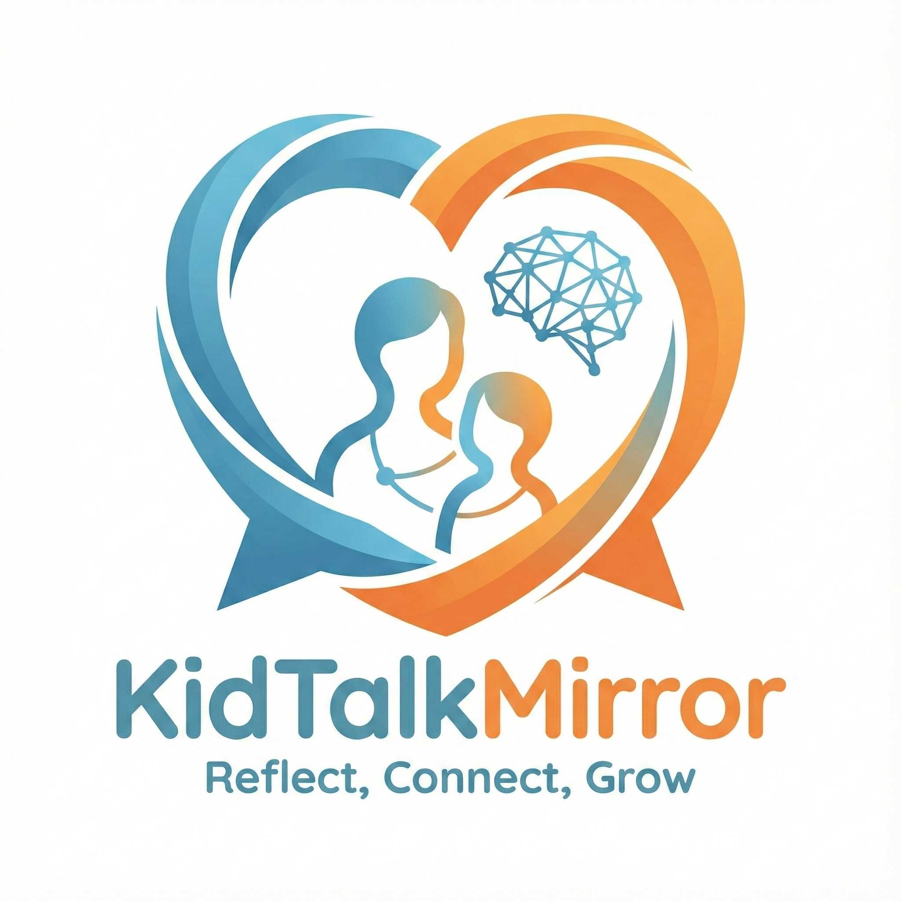

# KidTalkMirror: An AI-Supported Reflection Tool for Parent–Child Communication
**Presented by: Aoxin Luo, Haowei Li, Shiyang Zhang**

## Project Overview
KidTalkMirror is an AI-assisted reflective tool designed to support parents in engaging in more empathetic, developmentally appropriate, and constructive conversations with their children. The system focuses on everyday parent–child interactions (e.g., school stress, emotional regulation, learning challenges) and provides real-time or post-conversation reflective feedback grounded in educational psychology and communication principles.

Rather than replacing parental judgment, KidTalkMirror aims to **scaffold reflection**, helping parents:
- Recognize emotional cues in children’s speech
- Reflect on their own questioning, tone, and responses
- Explore alternative supportive responses
- Build healthier communication habits over time




This repository documents the **end-to-end design process**, from initial ideation to prompt engineering and workflow testing, following the course milestones.

---

## Milestone Description

### [Milestone 1: Pitch Ideas](milestone_1_pitch_ideas/)

This folder contains individual idea pitches from each group member. Each notebook documents early-stage brainstorming, including problem identification, target users, and initial concept exploration. These ideas served as the foundation for group discussion and comparison before selecting a final project direction.

---

### [Milestone 2: Idea Selection](milestone_2_idea_selection/)
This milestone documents the group’s concept selection and refinement process. Materials in this folder focus on comparing alternative ideas, defining the core problem and value proposition, identifying primary users and scenarios, and outlining the key functions and constraints of the selected concept, **KidTalkMirror**.

---

### [Milestone 3: Prompting](milestone_3_prompting/)
This folder contains the core prompt engineering work for KidTalkMirror. It includes a meta-prompt defining the AI’s role, tone, and constraints; scenario-based prompt development and testing; and visual prompt framework diagrams. The prompting work emphasizes empathy, non-judgmental language, and actionable reflection rather than prescriptive advice.

---

### [Milestone 5: Workflow Testing](milestone_5_workflow_testing/)
This milestone focuses on system-level workflow design and testing. It documents the end-to-end application flow from user input to AI-generated output, including implementation logic, testing considerations, and a visual workflow diagram illustrating how the system would function in practice.

---

## Repository Structure

```text
comm4190_F25_Final_Project_Group12/
│
├── milestone_1_pitch_ideas/
│   ├── Florrie_KidTalkMirror.ipynb
│   ├── haowei_idea.ipynb
│   └── shiyang_idea copy.ipynb
│
├── milestone_2_idea_selection/
│   └── (Idea selection materials, concept refinement, and use case documentation)
│
├── milestone_3_prompting/
│   ├── meta_prompt.ipynb
│   ├── S3_prompt_development.ipynb
│   ├── S4_prompt_development.ipynb
│   ├── Scenario5_Florrie.ipynb
│   ├── Scenario6_Florrie.ipynb
│   ├── Prompt_Scenario1
│   ├── Prompt_Scenario2
│   ├── prompt_framework_1.png
│   └── prompt_framework_2.png
│
├── milestone_5_workflow_testing/
│   ├── workflow_development_and_testing.ipynb
│   └── workflow_kidtalkmirror_mermaid.png
│   └── Kidtalk_Mirror_Model.json
│
└── README.md
